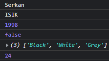

# Object

```jsx
let person = {
    firstName: 'Serkan',
    lastName: 'ISIK',
    yearOfBirth: 1998,
    married: false,
    favoriteColors: ['Black', 'White', "Grey"],
		//Method
    calculateAge: function () { 
        this.age = 2022 - this.yearOfBirth;
    }
};

console.log(person.firstName);
console.log(person.lastName);
console.log(person.yearOfBirth);
console.log(person.married);
console.log(person.favoriteColors);

person.calculateAge(); 
console.log(person.age); //you have to call the function first
```



```jsx
let person = {
    firstName: 'Serkan',
    lastName: 'ISIK',
    yearOfBirth: 1998,
    married: false,
    favoriteColors: ['Black', 'White', "Grey"],
};

console.log(person['firstName']);
console.log(person['lastName']);
console.log(person['yearOfBirth']);
console.log(person['married']);
console.log(person['favoriteColors']);
```


```jsx
let person = {
    firstName: 'Serkan',
    lastName: 'ISIK',
    yearOfBirth: 1998,
    married: false,
    favoriteColors: ['Black', 'White', "Grey"],
};

let person2 = {
    firstName: 'Esmanur',
    lastName: 'MAZLUM',
    yearOfBirth: 2000,
    married: false,
    favoriteColors: ['Black', 'Green', "Blue"],
};

//Array
let people = [person, person2];

console.log(people);
console.log(people[0].firstName);
console.log(people[1].firstName);
```


```jsx
let person = new Object();

person.firstName = "Serkan";
person.lastName = "ISIK"
person.yearOfBirth = 1998;

console.log(person.firstName);
console.log(person.lastName);
console.log(person.yearOfBirth);
```


---

## Second Part

```jsx
let person = {
    firstName: 'Serkan',
    lastName: 'ISIK',
    //year-Of-Birth: 1998,  //Hatalı !
    ['year-Of-Birth']: 1998 // "-"  kullanımı
};

console.log(person.firstName);
console.log(person.lastName);
console.log(person['year-Of-Birth']);
```


```jsx
//object literals
let person = {
    firstName: 'Serkan',
    age: 23,
    bilgileriSoyle: function () {
        return `Benim adım ${this.firstName} ben ${this.age} yaşındayım`; //template literal				
    }
};

console.log(person.bilgileriSoyle());
```


```jsx
let person = {
    firstName: 'Serkan',
    age: 23
};

console.log(person);

person.age = 24;

console.log(person);

person.lastName = 'ISIK';

console.log(person);

//Oluşturulan yapıyı sonradan değiştirmek önerilmez, çünkü takibi zorlaşır.
```


```jsx
let person = {
    firstName: 'Serkan',
    lastName: 'ISIK',
    age: 23,
};
console.log(person);

console.log("--------------");

//factory functions
//bu fonksiyon object döndürür.
function createPerson(parFirstName,parLastName,parAge){
    return {
        firstName: parFirstName,
        lastName: parLastName,
        age: parAge
    }
}

const serkan = createPerson('Serkan', 'ISIK', 23);
console.log(serkan);

const esmanur = createPerson('Esmanur', 'MAZLUM', 21);
console.log(esmanur);
```

