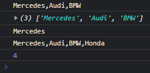

### Ternary If

```jsx
let a = 10, b = 5, c = 0;

if (a>b){
    c = a + b;
}
else{
    c = a - b;
}
console.log("The value of c is: "+c);
```

```jsx
let a = 10, b = 5, c = 0;

c = (a > b) ? (a + b) : (a - b);
console.log("The value of c is: "+c);
```

---

<details>
  <summary>Function</summary>

```jsx
function sayHello(){
    console.log("Hello");
}

sayHello();
//Hello
```

---

```jsx
const myVariable = function () {
    return 2022-1998; 
}

let x = myVariable();
console.log(x);
//24
```

---

### ES6 - Fat Arrow

```jsx
const sayHello = () =>  {
    console.log("Hello");
}

sayHello();
//Hello
```

```jsx
/*Fat arrow, without parameters*/
const sayHello = _ => {
    console.log("Hello");
}

sayHello();
//Hello
```

```jsx
const fatArrowParametreli = (sayi) => {
    return sayi * sayi;
};

console.log(fatArrowParametreli(8));
//64
```

```jsx
/* Tek parametreli */
const fatArrowParametreliKisa = sayi => {
    return sayi * sayi;
}
console.log(fatArrowParametreliKisa(8));
//64
```

```jsx
/* Tek parametreli */
const fatArrowParametreliKisa = sayi => sayi * sayi;

console.log(fatArrowParametreliKisa(8));
//64
```

```jsx
const sayilariTopla = (s1, s2) => s1 + s2;

console.log(sayilariTopla(5,10));

const sayilariTopla2 = (s1, s2) => {
    return s1 + s2;
}
console.log(sayilariTopla2(5,10));
/*
15
15
*/
```
</details>

<details>
  <summary>Array</summary>

```jsx
let arabaMarkalari = ["Mercedes", "Audi", "BMW"];

console.log(arabaMarkalari.toString());
console.log(arabaMarkalari);
console.log(arabaMarkalari[0]);

arabaMarkalari[3] = "Honda";
console.log(arabaMarkalari.toString());

console.log(arabaMarkalari.length);
```



```jsx
let arabaMarkalari = ["Mercedes", "Audi", "BMW"];

for (let i = 0; i < arabaMarkalari.length; i++) {
    console.log(arabaMarkalari[i]);
}

for (let anlıkDiziElemani of arabaMarkalari) {

    console.log(anlıkDiziElemani);

}
```


```jsx
let myArray = [1, "emre", true];
```
</details>

<details>
  <summary>Array Function</summary>

```jsx
let isimler = ["emre", "hasan", "ayşe"];
console.log(isimler.toString());
console.log(isimler.join(".&."));
```


```jsx
let isimler = ["emre", "hasan", "ayşe"];
console.log(isimler.toString());

//push diziye eleman ekler ve dizinin yeni boyutunu geri döndürür.
let diziElemanSayisi = isimler.push("ali");
console.log(isimler.toString());
console.log(diziElemanSayisi);

//pop diziden eleman çıkarır ve çıkardığı elemanı geri döndürür.
let dizidenCikarilanEleman = isimler.pop();
console.log(isimler.toString());
console.log(dizidenCikarilanEleman);
```


```jsx
let isimler = ["emre", "hasan", "ayşe"];
console.log(isimler.toString());

//dizinin ilk elemanını çıkarır ve bu cıkarılan elemanı döndürür.
let x = isimler.shift();
console.log(isimler.toString());
console.log(x);

//dizinin en basına eleman ekler ve dizinin yeni eleman sayısını döndürür.
let y = isimler.unshift("serkan");
console.log(isimler.toString());
console.log(y);
```


```jsx
let isimler = ["emre", "hasan", "ayşe"];
console.log(isimler.toString());

//delete ile verilen indeksteki eleman silinir.
delete isimler[1];
console.log(isimler.toString());
console.log(isimler[0]);
console.log(isimler[1]);
console.log(isimler[2]);
```


```jsx
let fruits = ["Banana", "Orange", "Apple", "Mango"];
console.log(fruits.toString());

// At position 2, remove 1 element, add 2 elements
// Return value: an array containing the removed items (if any).
fruits.splice(2, 1, "Lemon", "Kiwi");
console.log(fruits.toString());
```


```jsx
let fruits = ["Banana", "Orange", "Apple", "Mango"];
console.log(fruits.toString());

// At position 2, don't delete any element, add 2 elements
fruits.splice(2, 0, "Lemon", "Kiwi");
console.log(fruits.toString());
```


```jsx
let fruits = ["Banana", "Orange", "Apple", "Mango", "Kiwi"];
console.log(fruits.toString());

// At position 2, remove 2 items: 
fruits.splice(2, 2);
console.log(fruits.toString());
```


```jsx
//The concat() method concatenates (joins) two or more arrays

const arr1 = ["Cecilie", "Lone"];
const arr2 = ["Emil", "Tobias", "Linus"];

const children = arr1.concat(arr2); 

console.log(arr1.toString());
console.log(arr2.toString());
console.log(children.toString());
```


```jsx
//Array.slice() returns selected array elements as a new array

const fruits = ["Banana", "Orange", "Lemon", "Apple", "Mango"];
const citrus = fruits.slice(1, 3);
console.log(fruits.toString());
console.log(citrus.toString());
```


</details>

<details>
  <summary>Object</summary>

```jsx
let person = {
    firstName: 'Serkan',
    lastName: 'ISIK',
    yearOfBirth: 1998,
    married: false,
    favoriteColors: ['Black', 'White', "Grey"],
    calculateAge: function () {
        this.age = 2022 - this.yearOfBirth;
    }
};

console.log(person.firstName);
console.log(person.lastName);
console.log(person.yearOfBirth);
console.log(person.married);
console.log(person.favoriteColors);

person.calculateAge(); 
console.log(person.age); //you have to call the function first
```


```jsx
let person = {
    firstName: 'Serkan',
    lastName: 'ISIK',
    yearOfBirth: 1998,
    married: false,
    favoriteColors: ['Black', 'White', "Grey"],
};

console.log(person['firstName']);
console.log(person['lastName']);
console.log(person['yearOfBirth']);
console.log(person['married']);
console.log(person['favoriteColors']);
```


```jsx
let person = {
    firstName: 'Serkan',
    lastName: 'ISIK',
    yearOfBirth: 1998,
    married: false,
    favoriteColors: ['Black', 'White', "Grey"],
};

let person2 = {
    firstName: 'Esmanur',
    lastName: 'MAZLUM',
    yearOfBirth: 2000,
    married: false,
    favoriteColors: ['Black', 'Green', "Blue"],
};

//Array
let people = [person, person2];

console.log(people);
console.log(people[0].firstName);
console.log(people[1].firstName);
```


```jsx
let person = new Object();

person.firstName = "Serkan";
person.lastName = "ISIK"
person.yearOfBirth = 1998;

console.log(person.firstName);
console.log(person.lastName);
console.log(person.yearOfBirth);
```


</details>


[Referans Tipler Çalışma Mantığı](Notes/referansTiplerÇalışmaMantığı/README.md)

[Higher Order and Callback Functions](Notes/higherOrderAndCallbackFunctions/README.md)